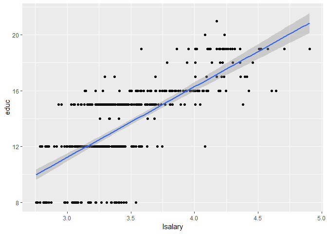
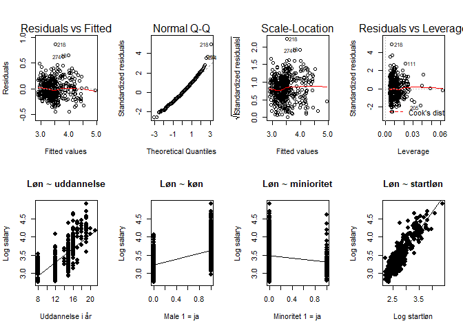
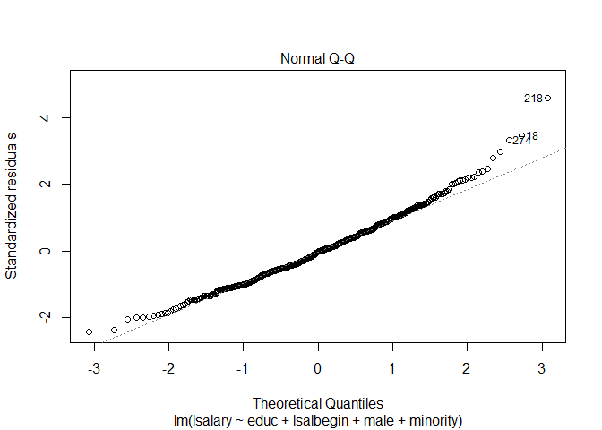

Eksamens opgave 1 - OLS og Hetroskedasticitet
================
Lars Boerty Nielsen - 20134303
25 sep 2017

Betragt følgende model for bankansattes løn:
log(*s**a**l**a**r**y*)=*β*<sub>0</sub> + *β*<sub>1</sub>*e**d**u**c* + *β*<sub>2</sub>*l**o**g*(*s**a**l**b**e**g**i**n*)+*β*<sub>3</sub>*m**a**l**e* + *β*<sub>4</sub>*m**i**n**o**r**i**t**y* + *u*

-   *s**a**l**a**r**y* er årsløn (i 1000 US dollars)
-   *e**d**u**c* er uddannelse målt i antal år
-   *s**a**l**b**e**g**i**n* er startlønnen (i 1000 US dollars) for personens første stilling i samme bank
-   *m**a**l**e* er en dummy-variabel for køn
-   *m**i**n**o**r**i**t**y* er en dummy-variabel der angiver om man tilhører en minoritet

Datasættet data1, som er tilgængelig påMoodle, indeholder disse variable målt for 474 bankansatte.

Opgave 1: Estimer modellen vha. OLS. Kommenter på outputtet og fortolk resultaterne.
------------------------------------------------------------------------------------

``` r
#MLR - Multiple linær regression
lm<-lm(lsalary ~ educ + lsalbegin + male + minority)
summary(lm)
```

    ## 
    ## Call:
    ## lm(formula = lsalary ~ educ + lsalbegin + male + minority)
    ## 
    ## Residuals:
    ##      Min       1Q   Median       3Q      Max 
    ## -0.45572 -0.11508 -0.00516  0.10765  0.87060 
    ## 
    ## Coefficients:
    ##             Estimate Std. Error t value Pr(>|t|)    
    ## (Intercept)  0.84868    0.07512  11.298  < 2e-16 ***
    ## educ         0.02327    0.00387   6.013 3.66e-09 ***
    ## lsalbegin    0.82180    0.03603  22.808  < 2e-16 ***
    ## male         0.04816    0.01991   2.419   0.0160 *  
    ## minority    -0.04237    0.02034  -2.083   0.0378 *  
    ## ---
    ## Signif. codes:  0 '***' 0.001 '**' 0.01 '*' 0.05 '.' 0.1 ' ' 1
    ## 
    ## Residual standard error: 0.1766 on 469 degrees of freedom
    ## Multiple R-squared:  0.8041, Adjusted R-squared:  0.8024 
    ## F-statistic: 481.3 on 4 and 469 DF,  p-value: < 2.2e-16

``` r
library(ggplot2)
ggplot(data1, aes(lsalary, educ)) + 
  geom_point() + 
  geom_smooth(method='lm')
```

 Det kan her ses at modellen som er log - level (udover lsalbegin)

-   alle er signifikante på et 5% niveau
-   1 års uddannelse give 2% højere løn
-   at være mand giver 4% højere løn
-   at være minioritet giver ca. 4% lavere løn
-   log-log 1% højere startløn giver 0.8% højere løn

ud fra *R*<sup>2</sup> "goodness of fit" er 80% af lønnens variation forklaret med parametrene (hvis det kun er uddannelse der er den uafhængige parameter så kan 48% af lønnen forklares af dette)

*S**S**T* = *S**S**E* + *S**S**R*
*R*<sup>2</sup> ≡ *S**S**E*/*S**S**T* = 1 − *S**S**R*/*S**S**T*
$$SSE=\\sum\_{i=1}^{n}(\\hat{y\_i}-\\bar{y})^2 
\\qquad SST=\\sum\_{i=1}^{n}({y\_i}-\\bar{y})^2 
\\qquad SSR=\\sum\_{i=1}^{n}(\\hat{u\_i})^2$$

Al variation i en variabel y kan, med en uafhængig variabel, x, forklares med to ting: den del af variationen der forklares af x (SSE) og den del der ikke forklares af x (SSR). Vi har *R*<sup>2</sup> som er et mål for hvor meget vi kan forklare.

OLS mål er at minimere SSR

Vi kan også se at uddannelse og start løn er meget signigikante, mens køn og minioritet ikke er særligt, men kan dog afvise at der ikke er nogen effekt på 5% signifikansniveau.

(En detalje er at modellen måske ikke fanger alt diskriminationen. Vi skal forstå minority estimatet som når de andre faktorere holdes fast, dette giver selvfølgelig mening med uddannelse, at sammenligne minoritet og ikke minoritet på samme uddannelsesniveau, men vi holder også startlønnen fast og kan derfor ikke se om en minoritet til at starte med betales mindre. Dette bekræftes hvis vi fjerner lsalbegin fra modellen så får vi en væsentligt højere diskrimination af minioriteter.)

Opgave 2: Udfør grafisk modelkontrol.
-------------------------------------



1.  graf kan man se at residualerne er linære og normaltfordelte

2.  graf bekræftes det at residualerne er normaltfordelte, med et par outliers, dette er vigtigt i forhold til hypotesetest og se()

3.  graf ser også fin ud da der ikke er nogle større udsving i de standardiserede residualer over de fittede værdier

4.  graf viser at der ikke er store outliers

På de 4 sidste grafer er der individuelle regressioner og de bekrafter forholdet i den oprindelige korrelation mellem de 3 positive og en negativ mellem løn og minioritet

Opgave 3: Test for heteroskedasticitet vha. Breusch-Pagan-testet og specialudgaven af White-testet
--------------------------------------------------------------------------------------------------

Hetroskedasticitet er når variansen ikke er konstant over *u* Dette skal være opfyldt i for at kunne hypoteseteste og udregne standard fejl. Her ses kravet for hetroskedasticitet, *H*<sub>1</sub>:
*H*<sub>0</sub> = *V**a**r*(*u*|*x*)=*σ*<sup>2</sup>  *H*<sub>1</sub> = *V**a**r*(*u*|*x*)≠*σ*<sup>2</sup>

BP-testen og specialudgaven af White testen kan teste for hetroskedasticitet (*h*<sub>0</sub> er i begge tilfælde er **homoskedasticitet**). Begge test tager udgangspunkt i sqres ($\\hat{u}^2$)
\* hvor BP-testen laver en ny regression ift. de uafhængige variabler (og benytter en lagrange multiplier test LM) \* en specielle White gør det ift. fitted values og kvardrede fitted values.

*u*<sup>2</sup> = *δ*<sub>0</sub> + *δ*<sub>1</sub>*x*<sub>1</sub> + *δ*<sub>2</sub>*x*<sub>2</sub> + . + *δ*<sub>*k*</sub>*x*<sub>*k*</sub> + *v*
$$LM=R^2\_{\\hat{u}} \*n$$

Først gennemgår vi Breusch-Pagan-testen

``` r
#Manuel BP-test - Jeg tager "squared residuals" (u^2)
sqres<-(lm$residuals)^2

#Jeg kører nu en ny regression med sqres som afhængig variabel (her kan BP-testen med F-statistikken aflæses direkte)
lm2<-lm(sqres ~ educ + lsalbegin + male + minority)
summary(lm2)
```

    ## 
    ## Call:
    ## lm(formula = sqres ~ educ + lsalbegin + male + minority)
    ## 
    ## Residuals:
    ##      Min       1Q   Median       3Q      Max 
    ## -0.04773 -0.02506 -0.01345  0.00908  0.71750 
    ## 
    ## Coefficients:
    ##               Estimate Std. Error t value Pr(>|t|)
    ## (Intercept)  0.0036404  0.0235992   0.154    0.877
    ## educ         0.0019699  0.0012157   1.620    0.106
    ## lsalbegin   -0.0008061  0.0113201  -0.071    0.943
    ## male         0.0094827  0.0062553   1.516    0.130
    ## minority    -0.0104497  0.0063908  -1.635    0.103
    ## 
    ## Residual standard error: 0.05548 on 469 degrees of freedom
    ## Multiple R-squared:  0.02923,    Adjusted R-squared:  0.02095 
    ## F-statistic: 3.531 on 4 and 469 DF,  p-value: 0.007475

``` r
#Nu laver vi BP-testen med LM-statistikken hvor vi bruger r^2 værdien fra vores regression
r2<-0.02923
1-pchisq((r2*length(data1$salary)),4)
```

    ## [1] 0.007772441

``` r
#Breusch-Pagan-test med R (bruger som standard LM-statistikken)
bptest(lm)
```

    ## 
    ##  studentized Breusch-Pagan test
    ## 
    ## data:  lm
    ## BP = 13.857, df = 4, p-value = 0.007767

-   **BP-test med F-statistikken: P=0.00747**
    For effekten på de kvardrede residualer kan vi afvise at den er homoskedastisk, vores *H*<sub>0</sub>, den er altså hetroskedastisk. Det vil altså sige at de uafhængige variabler kan forklare ændringer i residualerne

-   **BP-test med LM-statistikken P=0.00776**
    LM-statistikken (som benytter en chi^2 fordeling) bekræfter hvad vi ved fra F-statistikken (kan afvises på 5% signifikansniveau)

Modellen lider altså derfor af hetroskedasicitet. Det betyder at variansen af residualerne ikke er konstant over regressionen. Det bryder med MLR5 antagelsen om at

*v**a**r*(*u* ∣ *x*<sub>1</sub>, ..., *x*<sub>*k*</sub>)=*σ*<sup>2</sup>
 Dette betyder at vores model bryder med BLUE (Best Linary Unbiased Model)

Nu undersøger vi med White testen (s.253)

``` r
#Vi skal bruge fittedvalues^2 for at bruge specialudgaven af White testen
sqfitted<-(lm$fitted.values)^2
#Nu kører vi en ny regression med disse og fitted values sammen med residualerne^2 
lm3<-lm(sqres ~ lm$fitted.values + sqfitted)
summary(lm3)
```

    ## 
    ## Call:
    ## lm(formula = sqres ~ lm$fitted.values + sqfitted)
    ## 
    ## Residuals:
    ##      Min       1Q   Median       3Q      Max 
    ## -0.04432 -0.02604 -0.01462  0.00723  0.72279 
    ## 
    ## Coefficients:
    ##                  Estimate Std. Error t value Pr(>|t|)
    ## (Intercept)      -0.30604    0.19603  -1.561    0.119
    ## lm$fitted.values  0.16726    0.10832   1.544    0.123
    ## sqfitted         -0.01996    0.01483  -1.346    0.179
    ## 
    ## Residual standard error: 0.05555 on 471 degrees of freedom
    ## Multiple R-squared:  0.02295,    Adjusted R-squared:  0.01881 
    ## F-statistic: 5.533 on 2 and 471 DF,  p-value: 0.004217

``` r
#Vi aflæser den nye r^2 værdi som bruges ved F og LM testen (F-testen er kan allerede aflæses i summary)
r2.1<-0.02295
1-pchisq((r2.1*length(data1$salary)),2)
```

    ## [1] 0.004343173

-   **White-test med F-statistikken: P=0.00422**
-   **White-test med LM-statistikken: P=0.00434**

Her kan vi igen afvise homoskedacitet ved 5% signifikansniveau

Opgave 4: Beregn robuste standardfejl for modellen og sammenlign med resultaterne i spørgsmål 1.
------------------------------------------------------------------------------------------------

Vi kan udregne disse med R: disse er anderledes fordi at modellen udviser hetroskedasitet. Udregningen af disse er en nyere metode og matematisk uden for pensum, men den korregerer for ukendt hetroskedasticitet. Den kan gøre dette på flere måder som afhænger af hvordan data ser ud. Jeg bruger HC0

$$
\\text{SLR: robuste varians:}  \\qquad
var(\\beta\_1)=\\frac{\\sum\_{i=1}^{n}(x\_i-\\bar{x})^2\\sigma^2\_{i}}{SSR\_x^2}
\\qquad \\rightarrow \\qquad
\\sigma^2\_i \\rightarrow \\hat{u}^2\_i 
\\qquad \\rightarrow \\qquad
var(\\hat\\beta\_1)=\\frac{\\sum\_{i=1}^{n}(x\_i-\\bar{x})^2\\hat u^2\_{i}}{SSR\_x^2}$$

``` r
rlm<-coeftest(lm, vcov = vcovHC(lm, type = "HC0"))
screenreg(list(REG = lm, ROBUST_REG = rlm), digits = 4)
```

    ## 
    ## ======================================
    ##              REG           ROBUST_REG 
    ## --------------------------------------
    ## (Intercept)    0.8487 ***   0.8487 ***
    ##               (0.0751)     (0.0794)   
    ## educ           0.0233 ***   0.0233 ***
    ##               (0.0039)     (0.0035)   
    ## lsalbegin      0.8218 ***   0.8218 ***
    ##               (0.0360)     (0.0374)   
    ## male           0.0482 *     0.0482 *  
    ##               (0.0199)     (0.0200)   
    ## minority      -0.0424 *    -0.0424 *  
    ##               (0.0203)     (0.0177)   
    ## --------------------------------------
    ## R^2            0.8041                 
    ## Adj. R^2       0.8024                 
    ## Num. obs.    474                      
    ## RMSE           0.1766                 
    ## ======================================
    ## *** p < 0.001, ** p < 0.01, * p < 0.05

Det ses at estimaterne er de samme, men standard fejlene er anderledes, nogle er større andre er mindre. Dette passer med at vi ved at hetroskedasticitet ikke er et problem for at finde estimaterne, det er først når vi skal lave følgeslutninger (hypotesetest, etc.)

Opgave 5: Test hypotesen *H*<sub>0</sub> : *β*<sub>2</sub> = 1    *H*<sub>1</sub> : *β*<sub>2</sub> ≠ 1
-------------------------------------------------------------------------------------------------------

hypotesen er at log løn er lig med 1, jeg skal se om den kan forkastes

Normalt udregnes t-værdien som
$$t=\\frac{\\hat\\beta\_2-\\beta)}{se(\\hat\\beta\_2)}$$
 Hvor den sande beta er = o, dette giver t-værdien = 22.808 (Vi ville klart forkaset at logløn = 0, men dette er ikke spørgsmålet) men vi gør nu
$$t=\\frac{\\hat\\beta\_2-1)}{se(\\hat\\beta\_2)}$$

``` r
(0.8218-1)/0.036
```

    ## [1] -4.95

``` r
qt(0.025,472)
```

    ## [1] -1.965003

``` r
2*pt(-4.95,472)
```

    ## [1] 1.03467e-06

Dette giver t-værdien = -4.95 (dette kan vi allerede se ikke er så godt, da n er stor, men vi kan finde en p-værdi) *H*<sub>0</sub> kan afvises på 5% signifikansniveau da vi afviser *H*<sub>0</sub> hvis *t* &lt; −1.96 eller *t* &gt; 1.96 Jeg kan også udregne p-værdien associeret med denne t-værdi, dette giver p=0.00000103

Jeg forkaster at logløn er lig med 1

Opgave 6: Test hypotesen *H*<sub>0</sub> : *β*<sub>3</sub> = *β*<sub>4</sub> = 0
--------------------------------------------------------------------------------

Der er 2 forskellige måder at forstå opgaven:

1.  At begge skal være lig 0, dette kan testes med en restricted model og en F-test
    $$F \\equiv \\frac{(SSR\_r-SSR\_{ur})/q} {SSR\_{ur}/(n-k-1)}$$
     q = Nummerator degrees of freedom, altså hvor mange færre parametre den restricted model har (2),
    k = Antal af parametre i modellen, den unrestricted (4) Dette kan også udregnes med *R*<sup>2</sup> værdierne hvis man ikke har *S**S**R*

``` r
hypotese_a<-c("male=0","minority=0")
linearHypothesis(lm, hypotese_a)
```

    ## Linear hypothesis test
    ## 
    ## Hypothesis:
    ## male = 0
    ## minority = 0
    ## 
    ## Model 1: restricted model
    ## Model 2: lsalary ~ educ + lsalbegin + male + minority
    ## 
    ##   Res.Df    RSS Df Sum of Sq      F  Pr(>F)  
    ## 1    471 14.892                              
    ## 2    469 14.627  2   0.26416 4.2349 0.01504 *
    ## ---
    ## Signif. codes:  0 '***' 0.001 '**' 0.01 '*' 0.05 '.' 0.1 ' ' 1

``` r
#Unrestricted model og unrestricted
ols.reg.unrestricted <- lm( lsalary ~ educ + lsalbegin + male + minority)
ols.reg.restricted <- lm( lsalary ~ educ + lsalbegin)

#Beregn q (antallet af variabler fjernet fra modellen)
q <- ols.reg.restricted$df.residual-ols.reg.unrestricted$df.residual

#Opnå r2
unrestricted.r2 <- summary(ols.reg.unrestricted)$r.squared
restricted.r2 <- summary(ols.reg.restricted)$r.squared

#Beregning af F-test
F <- ((restricted.r2-unrestricted.r2)/q)/((unrestricted.r2-1)/(471-2))
1 - pf(F, 2, 467)
```

    ## [1] 0.01504063

Vi kan se at vi med en F-test kan afvise at de to parametre begge er 0, med en p-værdi på 0.015

1.  Den anden måde at forstå opgaven: at estimatet på male og minority er lig med hinanden. I dette tilfælde finder vi t-værdien med følgende formel:
    $$t=\\frac{(\\hat\\beta\_3-\\hat\\beta\_4)}{se(\\hat\\beta\_3-\\hat\\beta\_4)}$$
     desværre er
    $$se(\\hat\\beta\_3-\\hat\\beta\_4) \\neq se(\\hat\\beta\_3)-se(\\hat\\beta\_4)$$
     men vi kan gøre dette
    $$se(\\hat\\beta\_3-\\hat\\beta\_4) = (se(\\hat\\beta\_3)^2-se(\\hat\\beta\_4)^2 - cov(\\hat\\beta\_3,\\hat\\beta\_4))^{0.5}$$
     Det er dog lidt besværligt at udregne det sidste, men derfor kan jeg gøre dette

Først laver vi en ny variabel som er lig med forskellen mellem de to estimater, vi vil gerne vide om denne kunne være = 0 og derved muliggøre at estimatet for lønpåvirkningen af køn og etcinitet er ens.
$$\\hat\\beta\_3-\\hat\\beta\_4=\\theta
\\qquad \\rightarrow \\qquad 
\\hat\\beta\_3=\\theta+\\hat\\beta\_4$$
 Vi kan indsætte dette i vores model, og omrokere
*l**s**a**l**a**r**y* = *β*<sub>0</sub> + *β*<sub>1</sub>*e**d**u**c* + *β*<sub>2</sub>*l**s**a**l**b**e**g**i**n* + (*θ* + *β*<sub>4</sub>)*m**a**l**e* + *β*<sub>4</sub>*m**i**n**o**r**i**t**y*)
*l**s**a**l**a**r**y* = *β*<sub>0</sub> + *β*<sub>1</sub>*e**d**u**c* + *β*<sub>2</sub>*l**s**a**l**b**e**g**i**n* + *θ**m**a**l**e* + *β*<sub>4</sub>(*m**i**n**o**r**i**t**y* + *m**a**l**e*)

Nu kan jeg køre modellen igen og denne gang finde *s**e*(*θ*) for at finde konfidensintervallet for *θ* så skal vi +/- med ca. 2\*standard fejlen

``` r
#Jeg definerer theta og min samlede variabel
theta<-summary(lm)$coefficients[4,1]-summary(lm)$coefficients[5,1]
malenority<-(male+minority)

#Nu kører jeg regressionen med den samlede
lm3<-lm(lsalary ~ educ + lsalbegin + male + malenority)
summary(lm3)$coefficients
```

    ##                Estimate Std. Error   t value     Pr(>|t|)
    ## (Intercept)  0.84867668 0.07511516 11.298341 2.404318e-26
    ## educ         0.02326829 0.00386958  6.013129 3.663557e-09
    ## lsalbegin    0.82179878 0.03603144 22.807828 5.024227e-78
    ## male         0.09052424 0.03126212  2.895653 3.960381e-03
    ## malenority  -0.04236862 0.02034173 -2.082842 3.780680e-02

``` r
#Nu skal vi bruge standard fejlen på theta (som nu er på male)
setheta<-summary(lm3)$coefficients[4,"Std. Error"]
CI<-c((theta-(1.96*setheta)),(theta+(1.96*setheta)))

#Nu får vi 95% konfidensintervallet på theta, som jo skal være 0
CI
```

    ## [1] 0.02925048 0.15179799

vi kan altså se at konfindens intervallet mellem *β*<sub>3</sub> og *β*<sub>4</sub> er: \[0.02925048; 0.151798\] Dette inkluderer ikke vores *H*<sub>0</sub> og vi kan derfor afvise *H*<sub>0</sub> med et 95% konfidensinterval

Det betyder i realiteten at der er forskel på kønnet og om man er minioritet når det kommer til løn. Vi kan både afvise at de skulle være 0, og at "bias" skulle være ens. (vi kan også se på P-værdien at vi kan afvise ned til et 0.01% signifikansniveau)

Opgave 7: Estimer modellen vha. FGLS og kommenter på resultaterne
-----------------------------------------------------------------

Vi har tidligere vist at modellen er homoskedastisk, og vi skal nu korrigerer for det (en anden metode end den robuste)

*v**a**r*(*u* ∣ *x*)=*σ*<sup>2</sup>*e**x**p*(*δ*<sub>0</sub> + *δ*<sub>1</sub>*x*<sub>1</sub> + *δ*<sub>2</sub>*x*<sub>2</sub> + *δ*<sub>3</sub>*x*<sub>3</sub> + *δ*<sub>4</sub>*x*<sub>4</sub>)

*l**o**g*(*u*<sup>2</sup>)=*a*<sub>0</sub> + *δ*<sub>1</sub>*x*<sub>1</sub> + *δ*<sub>2</sub>*x*<sub>2</sub> + *δ*<sub>3</sub>*x*<sub>3</sub> + *δ*<sub>4</sub>*x*<sub>4</sub>)+*e*
 med denne får vi de fitted values som vi indsætter i formlen $\\hat{h\_i}=exp(\\hat{g}\_i)$ Dette giver os vores vægt *w*

``` r
lsqres<-log(sqres)
lm4<-lm(lsqres ~ educ + lsalbegin + male + minority)
w<-exp(fitted(lm4))
lm5<-lm(lsalary ~ educ + lsalbegin + male + minority, weight=1/w)

screenreg(list(REG = lm, ROBUST = rlm, FGLS = lm5), digits = 4)
```

    ## 
    ## ====================================================
    ##              REG           ROBUST       FGLS        
    ## ----------------------------------------------------
    ## (Intercept)    0.8487 ***   0.8487 ***    0.8493 ***
    ##               (0.0751)     (0.0794)      (0.0756)   
    ## educ           0.0233 ***   0.0233 ***    0.0222 ***
    ##               (0.0039)     (0.0035)      (0.0038)   
    ## lsalbegin      0.8218 ***   0.8218 ***    0.8270 ***
    ##               (0.0360)     (0.0374)      (0.0358)   
    ## male           0.0482 *     0.0482 *      0.0487 *  
    ##               (0.0199)     (0.0200)      (0.0196)   
    ## minority      -0.0424 *    -0.0424 *     -0.0429 *  
    ##               (0.0203)     (0.0177)      (0.0187)   
    ## ----------------------------------------------------
    ## R^2            0.8041                     0.8046    
    ## Adj. R^2       0.8024                     0.8029    
    ## Num. obs.    474                        474         
    ## RMSE           0.1766                     1.9480    
    ## ====================================================
    ## *** p < 0.001, ** p < 0.01, * p < 0.05

Vi kan se at FGLS modellen har mindsket standard fejlene (se) men kun en lille smule

Opgave 8: Har FGLS estimationen taget højde for al heteroskedasticiteten?
-------------------------------------------------------------------------

``` r
bptest(lm)
```

    ## 
    ##  studentized Breusch-Pagan test
    ## 
    ## data:  lm
    ## BP = 13.857, df = 4, p-value = 0.007767

``` r
bptest(lm5)
```

    ## 
    ##  studentized Breusch-Pagan test
    ## 
    ## data:  lm5
    ## BP = 13.857, df = 4, p-value = 0.007767



Nej, der er stadig hetroskedasticitet
